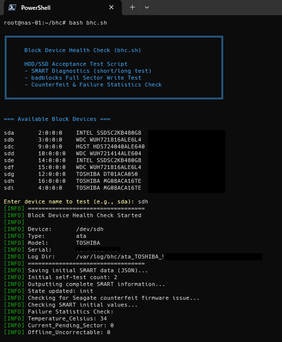
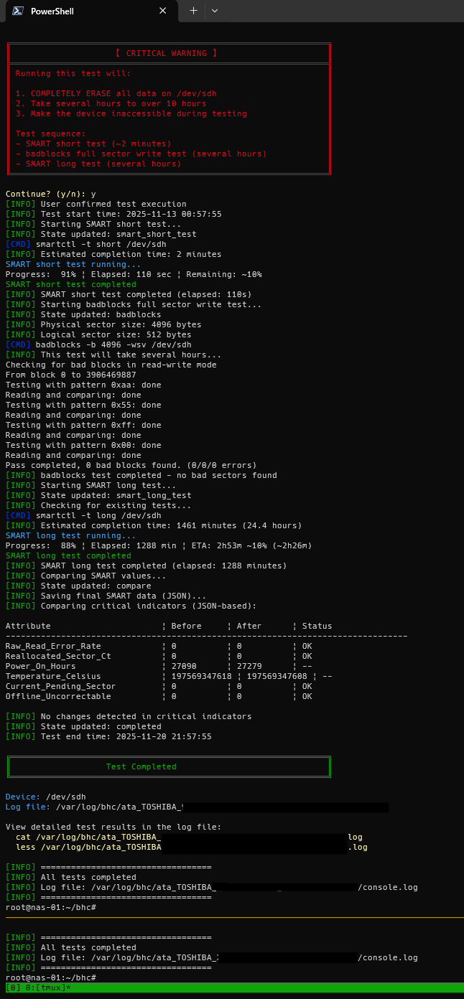

# bhc.sh - Block Device Health Check

HDD/SSD Acceptance Test Script for comprehensive drive validation and health checking.

## Overview

`bhc.sh` is a comprehensive bash script designed to perform thorough acceptance testing on HDDs and SSDs. It combines multiple diagnostic tools to validate drive health, detect counterfeit drives, and ensure data integrity.

### Key Features

- **SMART Diagnostics**: Executes short and long self-tests
- **Full Sector Write Test**: Uses badblocks to verify every sector
- **Counterfeit Detection**: Checks for known Seagate firmware issues
- **Failure Statistics**: Monitors critical SMART attributes
- **Resume Support**: Can resume interrupted tests
- **Detailed Logging**: All operations logged with JSON output
- **Progress Tracking**: Real-time progress display with ETA

## Requirements

### System Requirements

- Linux operating system
- Root privileges (sudo)
- tmux session (required for long-running tests)

### Software Dependencies

The following packages must be installed:

- `smartmontools` (version 7.0+ with JSON support)
- `e2fsprogs` (for badblocks)
- `util-linux` (for lsblk, blockdev)
- `jq` (for JSON parsing)
- `bc` (for calculations)

### Installation

On Debian/Ubuntu:

```bash
sudo apt update
sudo apt install -y smartmontools e2fsprogs util-linux jq bc
```

## Usage

### Basic Usage (Interactive Mode)

```bash
# Start a tmux session
tmux new-session -s bhc

# Run the script
sudo bash bhc.sh
```

The script will:
1. Display available block devices
2. Prompt you to select a device
3. Show warnings and ask for confirmation
4. Execute the test sequence

### Non-Interactive Mode

For automated testing, use the `-d` and `-y` options:

```bash
sudo bash bhc.sh -d sdg -y
```

### Command-Line Options

```
Options:
  -d DEVICE    Device name to test (e.g., sda, sdb)
  -y           Auto-confirm (skip all confirmation prompts)
  -h           Show help message

Examples:
  ./bhc.sh                    # Interactive mode
  ./bhc.sh -d sdg -y          # Non-interactive mode with device sdg
```

## Test Sequence

The script performs the following tests in order:

### 1. SMART Short Test (~2 minutes)
- Quick self-test to detect obvious issues
- Checks drive's built-in diagnostics
- Validates basic functionality

### 2. Badblocks Full Sector Write Test (several hours)
- **WARNING: DESTRUCTIVE - Erases all data**
- Writes and verifies every sector on the drive
- Tests with multiple patterns (0xaa, 0x55, 0xff, 0x00)
- Detects bad blocks and write/read errors

### 3. SMART Long Test (several hours)
- Comprehensive self-test covering entire drive
- Deeper diagnostics than short test
- Validates drive health after stress testing

### 4. SMART Value Comparison
- Compares critical attributes before and after testing
- Detects any degradation during testing
- Monitors: Raw_Read_Error_Rate, Reallocated_Sector_Ct, Current_Pending_Sector, Offline_Uncorrectable

## Critical Warnings

### Data Destruction

Running this test will **COMPLETELY ERASE** all data on the target device. Ensure you have:
- Selected the correct device
- Backed up any important data
- Unmounted the device

### Time Requirements

- Small drives (< 500GB): 2-4 hours
- Medium drives (1-2TB): 4-10 hours
- Large drives (> 4TB): 10-24+ hours

### Session Protection

The script **must** be run inside a tmux session because:
- Tests take several hours to complete
- SSH disconnection would abort the test
- tmux allows reconnecting to the session

## Output and Logs

### Log Directory Structure

Logs are saved to `/var/log/bhc/` with the following structure:

```
/var/log/bhc/
└── ata_TOSHIBA_MG08ACA16TE_<serial>_<timestamp>/
    ├── console.log           # All output and progress
    ├── smartctl_start.json   # Initial SMART data (JSON)
    ├── smartctl_end.json     # Final SMART data (JSON)
    ├── smartctl_current.json # Current SMART data during tests
    └── state.json            # Test state for resume support
```

### Viewing Results

After completion, view the results:

```bash
# View full log
cat /var/log/bhc/ata_*_<timestamp>/console.log
less /var/log/bhc/ata_*_<timestamp>/console.log

# View JSON SMART data
jq . /var/log/bhc/ata_*_<timestamp>/smartctl_start.json
jq . /var/log/bhc/ata_*_<timestamp>/smartctl_end.json
```

## Resume Support

If a test is interrupted (power loss, disconnection), the script can resume:

1. Run the script again with the same device
2. The script will detect the incomplete test
3. Choose to resume or start fresh
4. The script continues from the last completed phase

Phases:
- `init` - Initialization complete
- `smart_short_test` - SMART short test phase
- `badblocks` - Badblocks test phase
- `smart_long_test` - SMART long test phase
- `compare` - Comparison phase
- `completed` - All tests completed

## Screenshots

### Script Execution Start



The script displays:
- Banner and description
- Available block devices with model and serial
- Device selection prompt
- Initial SMART information and warnings
- Test confirmation prompt

### Test Execution and Completion



Shows:
- SMART short test progress and completion
- Badblocks test execution with pattern testing
- SMART long test with progress and ETA
- SMART value comparison (before/after)
- Final test completion message

## Monitored SMART Attributes

The script monitors these critical attributes:

| ID  | Attribute                  | Description                          |
|-----|----------------------------|--------------------------------------|
| 1   | Raw_Read_Error_Rate        | Read errors during normal operation  |
| 5   | Reallocated_Sector_Ct      | Count of reallocated sectors         |
| 9   | Power_On_Hours             | Total powered-on time                |
| 194 | Temperature_Celsius        | Current drive temperature            |
| 197 | Current_Pending_Sector     | Sectors waiting for reallocation     |
| 198 | Offline_Uncorrectable      | Uncorrectable sectors                |

Any changes in attributes 1, 5, 197, or 198 indicate potential drive issues.

## Counterfeit Detection

The script includes checks for known Seagate counterfeit firmware issues:
- Detects Seagate/Barracuda drives
- Logs firmware version
- Warns if verification is needed

## Exit Codes

- `0` - All tests passed successfully
- `1` - Error occurred (test failure, invalid device, missing dependencies)

## Troubleshooting

### "Must be run as root"

```bash
sudo bash bhc.sh
```

### "Must be run inside a tmux session"

```bash
tmux new-session -s bhc
sudo bash bhc.sh
```

### "Device is currently mounted"

```bash
sudo umount /dev/sdX
sudo bash bhc.sh -d sdX
```

### "smartctl does not support -j (JSON output)"

Update smartmontools:

```bash
sudo apt update
sudo apt install --only-upgrade smartmontools
```

### Test appears stuck

- Tests can take many hours for large drives
- Use `Ctrl+B, D` to detach from tmux session
- Reconnect with: `tmux attach-session -t bhc`
- Progress is saved and can be viewed in the log file

## Safety Features

1. **Root check**: Ensures script has necessary privileges
2. **tmux check**: Prevents accidental session loss
3. **Mount check**: Refuses to test mounted devices
4. **Multiple confirmations**: Warns before destructive operations
5. **State tracking**: Allows safe resume after interruption
6. **Detailed logging**: All operations are logged for audit

## License

This script is provided as-is for drive testing and validation purposes.

## Author

Created for HDD/SSD acceptance testing and counterfeit detection.

## Version History

- Initial release: Comprehensive acceptance testing with SMART and badblocks
- Added: JSON-based SMART parsing
- Added: Resume support for interrupted tests
- Added: Progress tracking with ETA display
